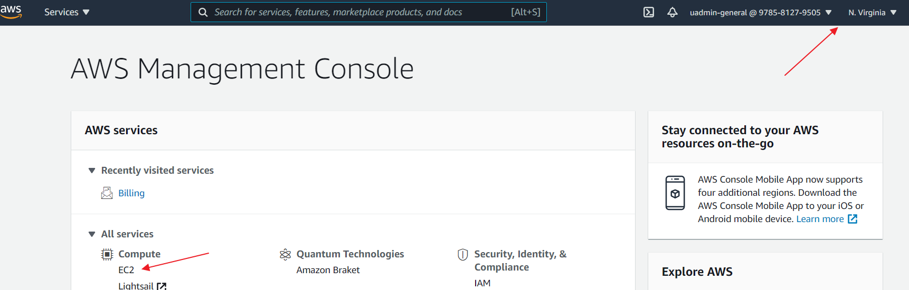
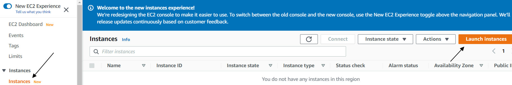
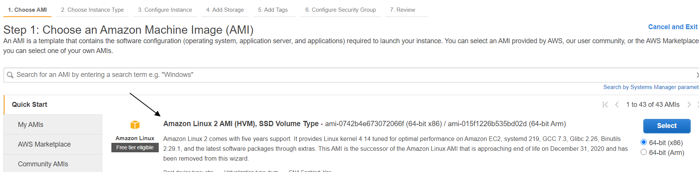
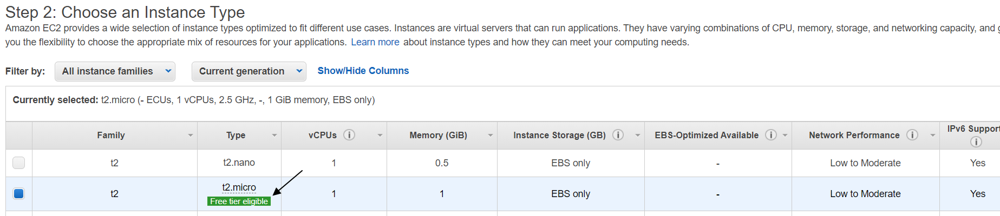
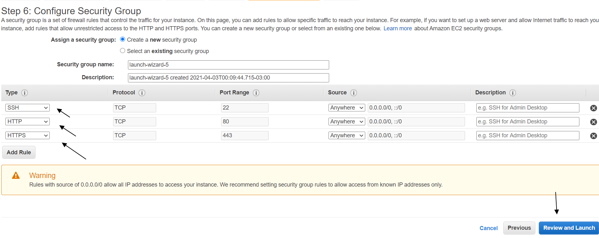
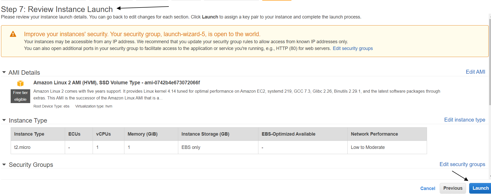
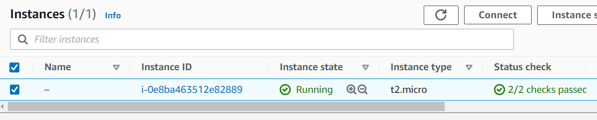
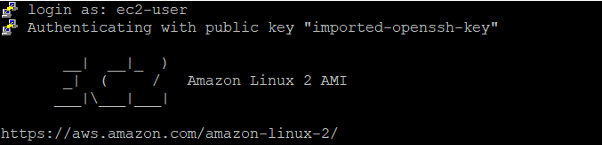

# Getting started in AWS EC2 

## Introduction

✍️ (Why) The idea of this excercise is to launch and configure a virtual machine in the AWS EC2 service.

## Prerequisite

✍️ (What) Access to aws console

## Use Case

- 🖼️ (Show-Me) Launch and configure an aws ec2 machine

## Try yourself

### Steps — Summary

1. Open console, make sure ypu are in US east 1 region and and select aws ec2 service
2. Choose an Instance Type: select and then click on the
3. Add Storage
4. Configure Security Group: SSH, HTTP, HTTPS for Custom  or Anywhere ip access.
5. Review and Launch
6. Create a new key pair, enter the name and save
7. Connect through SSH into EC2 Instance
8. Use putty and configure the keypair
10. Install an Apache Server
11. Switch to root user: sudo su
12. Run the updates
13. yum -y update
14. Install and run an apache server
15. yum install httpd
16. Press "Y" to confirm.
17. Start the web server
18. systemctl start httpd
19. Enable httpd:
20. systemctl enable httpd
21. Create and publish a test page
22. Navigate to the HTML folder
23. cd /var/www/html/
24. Create a test.html file using nano editor
25. Create a sample HTML content
26. Restart the webserver
27. systemctl start httpd
28. and you see your HTML page created in your browser as http://yourpublicipadress/test.html

