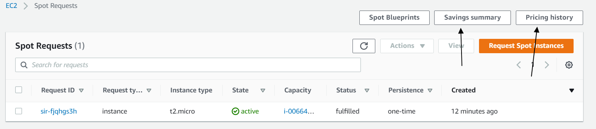

# Getting started in AWS EC2 Spot instances

## Introduction

✍️ (Why) The idea of this excercise is to launch an EC2 Spot Instance and learn about Saving Summary and pricing history options.

## Prerequisite

✍️ (What) Access to aws console

## Use Case

- 🖼️ (Show-Me) Launch and configure an aws ec2 Spot instance

## Try yourself

### Steps — Summary

1. Open console, make sure you are in US east 1 region and select aws ec2 service
2. Choose an AMI
3. Choose an Instance Type: select and then click on next
4. Now configure Instance Details:
	4.1 Number of instances: 1
	4.2 Purchasing option: click on Request Spot instances
	4.3 Now enter the price lower than shown there, example 0.034.
	4.4 Auto-assign Public IP: Select Enable
5. Click on advanced details and under the User data section paste this,
	#!/bin/bash
	sudo su
	yum update -y
	yum install httpd -y
	systemctl start httpd
	systemctl enable httpd
	echo "<html><h1> Testing EC2 spot instances</h1><html>" >>
	/var/www/html/index.html
6. Add Storage (you don't need to add anything)
7. Add Tags and next.
8. You need to configure a new Security Group, select "Create a new security group" and add the detail:
	- SSH and HTTP Custom 0.0.0.0/0.
9. Review and Launch 
10. Create a new key pair
11. Ready! Go to Instances page and wait the status of the EC2 Instance changes to running and health check status.
12. If you want to test the HTML page created, copy the Public IP address and run it on your browser.
13. Now we go to view the Spot Request details, click on Spot Requests.
14. Click on the Request ID, to see more details.
15. You can also view the Saving Summary and Pricing history.
16. On the right top bar, you will see two buttons named saving summary and pricing history.
17. In the pricing history you can change the report filters:
	- Graph: Select availability zones
	- Instance type: Select t2.micro
	- Platform: Select Linux/UNIX
	- Date Range: Select any date
18. Clean workspace
19. Click on Spot Requests and Select the present request.
20. On the right top, you will see Actions, click on cancel request.
21. Confirm the spot request Id and Check the option to Terminate Instances, click
on Confirm button.
22. After you will see the request, state as "cancelled" and status as "instance terminated".

